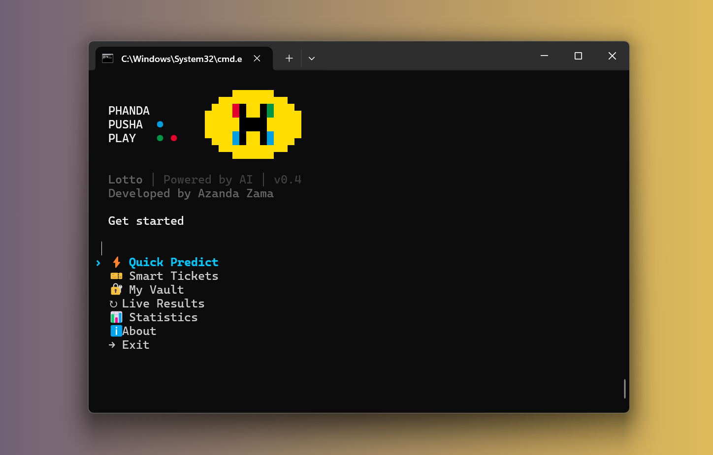

# SA Lotto AI



**AI-Powered Lottery Predictions for South Africa**


---

## Quick Start

```bash
# Clone & install
git clone https://github.com/azandabot/lotto-ai-draw.git
cd lotto-ai-draw
pip install -r requirements.txt

# Run interactive CLI
python -m main
```

---

## Features

| Feature | Description |
|---------|-------------|
| ⚡ **Quick Predict** | AI-powered fast number generation |
| 🎫 **Smart Tickets** | Budget-based Selbee wheeling strategy |
| 🔐 **My Vault** | Track plays, view history & stats |
| ↻ **Live Results** | Fetch latest draw data |
| 📊 **Statistics** | Hot/cold numbers, sparklines, trends |

---

## Interactive Menu

```
  Get started

  › ⚡ Quick Predict
    🎫 Smart Tickets
    🔐 My Vault
    ↻ Live Results
    📊 Statistics
    ℹ About
    → Exit
```

Navigate with **arrow keys**, select with **Enter**.

---

## CLI Commands

```bash
# Quick prediction
lotto quick -g daily_lotto

# Generate tickets with budget
lotto play -g daily_lotto -b 50

# View history
lotto history -g powerball -n 10

# View statistics
lotto stats -g lotto

# Fetch latest results
lotto fetch -g all
```

---

## Supported Games

| Game | Numbers | Cost |
|------|---------|------|
| Daily Lotto | 5 from 1-36 | R3 |
| LOTTO | 6 from 1-52 | R5 |
| LOTTO Plus 1/2 | 6 from 1-52 | R2.50 |
| PowerBall | 5+1 from 1-50 | R5 |
| PowerBall Plus | 5+1 from 1-50 | R2.50 |

---

## Tech Stack

- **Language**: Python 3.10+
- **AI/ML**: OpenAI GPT-4, NumPy, SciPy
- **CLI**: Click, InquirerPy, Rich
- **Data**: Pydantic, JSON
- **Web**: httpx, BeautifulSoup4

---

## Project Structure

```
lotto-ai-draw/
├── main.py              # CLI entry point
├── ui.py                # UI components (banner, spinner, menu)
├── config.py            # Game configurations
├── models.py            # Data models
├── storage.py           # JSON storage
├── fetcher.py           # Web scraper
├── predictor.py         # Prediction engine
├── analyzer.py          # Statistical analysis
├── ticket_generator.py  # Selbee strategy
├── play_tracker.py      # Play tracking
├── tests/               # Test suite (182 tests)
└── data/                # Stored lottery data
```

---

## Configuration

Create `.env` for AI predictions:

```bash
OPENAI_API_KEY=your-api-key-here
```

Without API key, uses local statistical analysis.

---

## Testing

```bash
pytest                          # Run all tests
pytest --cov=. --cov-report=html  # With coverage
```

**182 tests** covering all modules.

---

## Author

**Azanda Zama**
Email: judah.zama@gmail.com
GitHub: [@azandabot](https://github.com/azandabot)

---

## License

MIT License - see [LICENSE](LICENSE)

---

<p align="center">
  <strong>Proudly South African</strong><br>
  <em>Phanda, Pusha, Play!</em>
</p>

<p align="center">
  <sub>For entertainment only. Lottery is random. Play responsibly.</sub>
</p>
